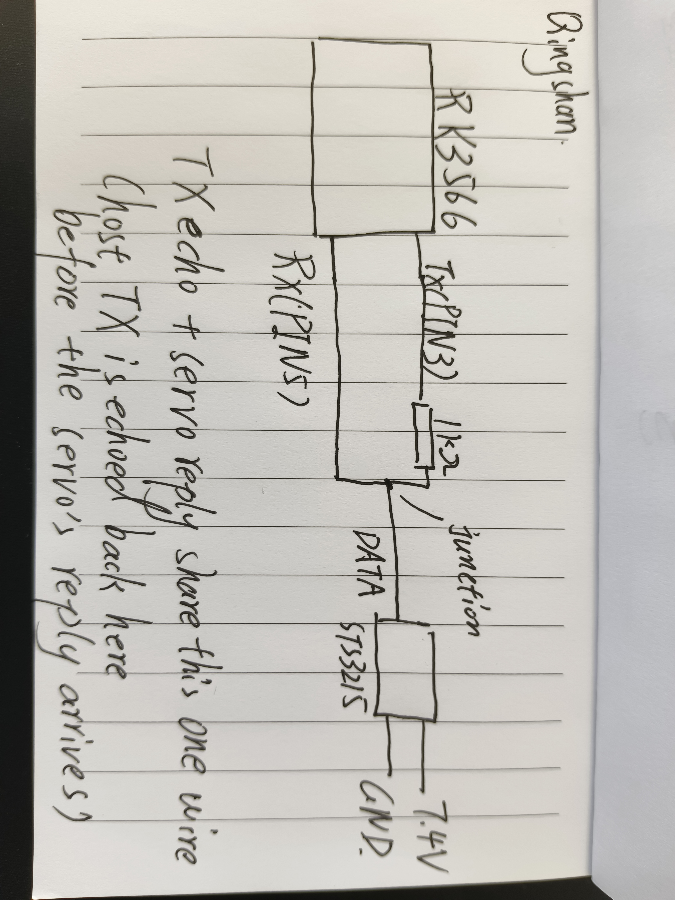

# Smartbench — A Multi-Sensor IoT Edge Device with Custom Linux Kernel Drivers

A graduation project exploring how **custom kernel-space device drivers**
affect resource utilisation, interrupt latency, and measurement quality on a
multi-sensor embedded Linux device, compared with user-space implementations.
The application is a **smart parcel-receiving bench**: a bench-shaped enclosure
that detects, weighs, and accepts deliveries automatically. The engineering
focus, however, is the **board support package (BSP) layer** — writing and
characterising the kernel drivers that connect the sensors to Linux.

## Hardware

| Component | Role | Interface |
|-----------|------|-----------|
| Radxa ROCK 3C (RK3566) | Main board, Debian Bullseye, kernel 5.10 | — |
| HC-SR04 | Ultrasonic distance (enclosure capacity) | 2x GPIO (TRIG/ECHO) |
| HX711 + 20 kg load cell | Weight on the lid (parcel detection) | Custom 2-wire serial |
| STS3215 | Serial bus servo (door lock actuator) | UART3, half-duplex (serdev) |
| KY-008 laser | Abandoned learning module — see *Engineering decisions* | 1x GPIO |

Sensors are powered at 3.3 V to remain within the SoC's GPIO voltage
tolerance. The STS3215 servo runs on a separate 7.4 V rail; all grounds are
common.

## Kernel drivers

Each driver is a self-contained loadable module. The sensor drivers use the
misc-device framework; the servo driver is a `serdev` client. Source is under
`drivers/`.

- **hcsr04** — HC-SR04 ultrasonic driver, implemented two ways:
  - **v1 (polling):** busy-waits on the ECHO line; `udelay(10)` trigger pulse
  - **v2 (IRQ):** captures both ECHO edges via GPIO interrupt, timestamps with
    `ktime_get()`, and blocks the reader on a wait queue until the falling edge
- **hx711** — HX711 24-bit ADC driver for the load cell. Bit-bangs the custom
  2-wire protocol with `local_irq_save()` to meet the chip's strict timing
  (SCK high must stay within 0.2–50 µs). Provides 10-sample averaging and an
  `ioctl` interface for tare and scale calibration.
- **sts3215** — Feetech STS3215 serial bus servo driver, built on the kernel
  **`serdev`** subsystem (see its own section below).
- **ky008** — minimal GPIO-output driver, used as an early learning step and
  later abandoned (see *Engineering decisions*).
- **hello** — Hello World module (the starting point).

## Results

### HX711: noise reduction from 10-sample averaging

The HX711 driver reads the 24-bit ADC 10 times per measurement and returns the
average, reducing random noise by approximately √10 ≈ 3.16×. Single-shot
quiescent reads show ~326 ADC counts of standard deviation; after averaging,
weighing a 205 g reference holds within ~2 g. The slow downward drift in both
panels is mechanical creep from a non-rigid mount — averaging cannot remove it,
only rigid mounting can.


### HC-SR04: polling vs interrupt — precision, resolution, and the hardware limit

With the target fixed at a tape-measured 16.5 cm and 20 readings per driver:

- **v1 (polling)** reports 17 cm every single time. Its zero variance is a
  **quantisation artefact** — the polling loop's fixed period bins the pulse
  width coarsely — not true precision, and it carries a systematic +0.5 cm bias.
- **v2 (IRQ)** reports 15–16 cm, resolving sub-centimetre variation via
  nanosecond ISR timestamps.

Neither is dramatically more accurate; absolute accuracy (~±1 cm) is bounded by
the HC-SR04 hardware and the temperature sensitivity of the speed of sound. The
real difference between implementations is in resolution and CPU cost, not
absolute accuracy.


### CPU utilisation: polling vs interrupt

Measured with `top` during a continuous measurement loop, three runs each:

| Scenario | Mean CPU |
|----------|---------:|
| System idle | ~7% |
| v1 (polling) | ~29% |
| v2 (IRQ) | ~25% |

The difference is smaller than the textbook "polling saturates a core"
expectation because the test harness (per-iteration `fork`/`exec` of `cat`)
dominates, and the short-range target produces a brief ECHO pulse. v2 is
consistently lower and far more stable. A follow-up test aimed at open space
(forcing the 60 ms timeout) would expose polling's full cost.


## The servo: serdev, device tree, and half-duplex

The STS3215 is the locker's actuator — a serial bus servo that both moves the
door latch and reports its own state back. Unlike the GPIO sensors, it speaks a
packet protocol (Feetech SCS/STS) at **1 Mbps over a single half-duplex wire**,
which makes its driver the most involved of the set.

**serdev, not a raw tty.** Rather than opening `/dev/ttySx` from userspace and
driving termios by hand, the driver is a kernel **`serdev` client** bound to
UART3. serdev models the servo as a device on the serial bus, so probe/remove,
baud configuration, and the RX callback are all handled in driver context.

**Device tree without overlays.** The kernel image was built **without
`CONFIG_OF_OVERLAY`**, so the usual overlay route was unavailable. Binding was
done instead by adding a child node (`compatible = "malus,sts3215"`) directly
under the UART3 node in the **main device tree**, with the original DTB backed
up first.

**Half-duplex request/response on one wire.** Sending a command is one-way, but
reading feedback is a full request/response exchange on a single shared line.
Every byte the host transmits is **echoed back** on that line before the servo's
reply arrives, so the driver:

1. primes a skip counter with the transmit length to **strip the TX echo**,
2. reassembles the reply with a **byte-wise frame state machine**
   (`FF FF . ID . LEN . ERR . params . checksum`), validating the checksum,
3. blocks the reader on a **`completion`** that the RX callback signals once a
   full frame has arrived.

Position, speed, load, voltage, current and temperature are exposed as sysfs
attributes; motion and torque are controlled the same way.



### Debugging story: the servo that received but never replied

The hardest fault in the project, kept here because the method matters more
than the fix.

**1 — `serdev_device_write()` returned `-EINVAL`; nothing left the UART.** In
the 5.10 kernel the blocking write path rejects the transfer unless the client
provides a `write_wakeup` callback in `serdev_device_ops`. Wiring in the in-tree
helper `serdev_device_write_wakeup` fixed transmission and the servo moved.

**2 — sending worked, but every feedback read timed out (`-ETIMEDOUT`).** A
diagnostic build that dumped the raw RX bytes showed the problem precisely: the
only bytes received were the host's *own* transmitted packet echoed back —
nothing from the servo. That proved RX hardware worked (it caught the echo) and
that the servo received commands (it moved), narrowing the fault to the
servo->host direction.

**3 — falsifying the wrong hypotheses with a control experiment.** The first
guess (servo response disabled) was tested on a second, independent host — a PC
with an FT232 USB-UART running an equivalent Python script. A naive TX/RX short
gave no reply either, which *looked* confirming but was itself a flawed test: a
push-pull TX with no series resistor fights the servo's reply and suppresses it.
Adding a **1 kΩ series resistor on TX** (matching the board) made the FT232 read
a clean reply — position `0x07FF` = 2047, mid-point. So the servo was fine; both
earlier "failures" were electrical.

**4 — root cause.** With identical wiring the FT232 read replies and the board
did not; the only remaining variable was the board's own wiring — and it was the
most ordinary fault in bring-up: **RX and TX were swapped.** One re-wire brought
up the full loop:

```
PING OK: bytes=[ff ff 01 02 01 fb . ff ff 01 02 00 fc]
feedback: position=2044 speed=0 load=-40 voltage=7.3V current=0mA temp=33C
```

Two of the hypotheses along the way were wrong. The takeaway is the method:
**falsify from the bottom up, and when a hypothesis fails, kill it with a
control experiment rather than arguing for it** — the byte-level diagnostics and
the FT232 comparison are what exposed the real fault.

## System integration

A userspace controller (`integration/`) ties the drivers into the actual
parcel-locker behaviour. It is deliberately layered so that the BSP work above
stays cleanly separated from the application logic:

- **`sensors.c` / `sensors.h` — hardware abstraction layer.** One uniform API
  over three *different* kernel interfaces: `read()` on `/dev/hcsr04`, `ioctl()`
  on `/dev/hx711`, and sysfs for the servo. `main.c` contains no `/dev` or
  `/sys` paths at all. The servo's sysfs directory is discovered at runtime
  rather than hard-coded.
- **`main.c` — polling state machine.** An event-driven loop:
  `STANDBY -> DETECTED -> WAIT_PARCEL -> PARCEL_PLACED -> LOCKING -> STANDBY`,
  with sensor faults routed to an `ERROR` state. It uses **debouncing** (N
  consecutive samples confirm a transition, rejecting single noisy pings),
  **timeouts with safe fallback** on every waiting state, **fail-safe locking**
  on error, and **graceful shutdown** (SIGINT releases servo torque and closes
  descriptors).

Polling on a fixed period — rather than blocking on each event — is a deliberate
choice here: a deterministic loop period is simple to reason about and fast
enough for this application.

## Engineering decisions

**Dropping the KY-008 laser module.** KY-008 began as a GPIO-output learning
step but never produced a usable signal across several wiring and supply
attempts. Rather than let it block the main line it was **deliberately cut** —
presence detection is already covered by the ultrasonic sensor, so the laser
added cost with no payoff. Knowing when to stop is part of the work; contrast it
with the servo above, which was worth chasing to the end.

**3.3 V supply instead of level shifting.** HC-SR04 and HX711 are nominally 5 V
parts whose outputs would need shifting down to the RK3566's 3.3 V GPIOs. After
level-shifting proved fiddly and inaccurate, the sensors were run **directly at
3.3 V**: their outputs then track 3.3 V and match the GPIOs natively, removing
the divider. The cost is slightly reduced range/margin — acceptable at short
range. A simplification bought with a bounded, well-understood trade-off.

## Building a driver

On the ROCK 3C with kernel headers installed:

```sh
cd drivers/<name>
make
sudo insmod ./<name>.ko
sudo dmesg | tail          # check probe output
```

Unload with `sudo rmmod <name>`. The userspace controller is built and run
separately:

```sh
cd integration
make
sudo ./locker              # needs root for /dev and sysfs access
```

Detection distance, parcel-weight threshold, and the servo's open/locked
positions are tunable constants at the top of `integration/main.c` and
`integration/sensors.h`.

## Status

Working: hello, hcsr04 (polling + IRQ), hx711 (read + calibration), sts3215
(motion + feedback), and the integrated controller running the full
detect -> open -> weigh -> lock loop. Abandoned: ky008. The mechanical
enclosure and final wiring harness are in progress.
