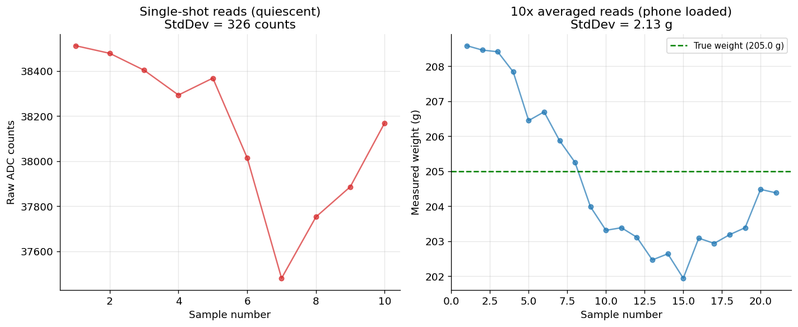
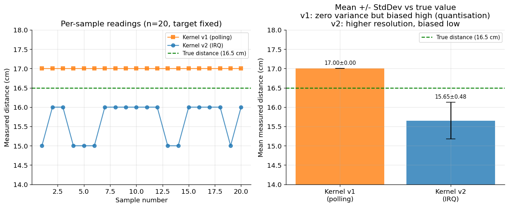
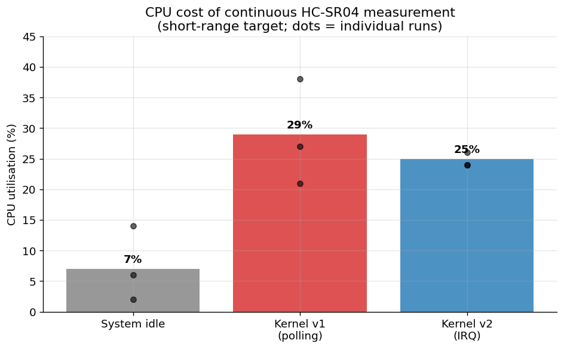

# Smartbench — A Multi-Sensor IoT Edge Device with Custom Linux Kernel Drivers

A graduation project exploring how **custom kernel-space device drivers**
affect resource utilisation, interrupt latency, and measurement quality on a
multi-sensor embedded Linux device, compared with user-space implementations.

The application is a **smart parcel-receiving bench**: a bench-shaped enclosure
that detects, weighs, and accepts deliveries automatically. The engineering
focus, however, is the **board support package (BSP) layer** — writing and
characterising the kernel drivers that connect the sensors to Linux.

## Hardware

| Component | Role | Interface |
|-----------|------|-----------|
| Radxa ROCK 3C (RK3566) | Main board, Debian Bullseye, kernel 5.10 | — |
| HC-SR04 | Ultrasonic distance (enclosure capacity) | 2x GPIO (TRIG/ECHO) |
| HX711 + 20 kg load cell | Weight on the lid (parcel detection) | Custom 2-wire serial |
| KY-008 laser | GPIO output learning module | 1x GPIO |

All sensors are powered at 3.3 V to remain within the SoC's GPIO voltage
tolerance.

## Kernel drivers

Each driver is a self-contained loadable module using the misc-device
framework. Source is under `drivers/`.

- **hcsr04** — HC-SR04 ultrasonic driver, implemented two ways:
  - **v1 (polling):** busy-waits on the ECHO line; `udelay(10)` trigger pulse
  - **v2 (IRQ):** captures both ECHO edges via GPIO interrupt, timestamps with
    `ktime_get()`, and blocks the reader on a wait queue until the falling edge
- **hx711** — HX711 24-bit ADC driver for the load cell. Bit-bangs the custom
  2-wire protocol with `local_irq_save()` to meet the chip's strict timing
  (SCK high must stay within 0.2–50 µs). Provides 10-sample averaging and an
  `ioctl` interface for tare and scale calibration.
- **ky008** — minimal GPIO-output driver used as a learning step.
- **hello** — Hello World module (the starting point).

## Results

### HX711: noise reduction from 10-sample averaging

The HX711 driver reads the 24-bit ADC 10 times per measurement and returns the
average, reducing random noise by approximately √10 ≈ 3.16×. Single-shot
quiescent reads show ~326 ADC counts of standard deviation; after averaging,
weighing a 205 g reference holds within ~2 g. The slow downward drift in both
panels is mechanical creep from a non-rigid mount — averaging cannot remove it,
only rigid mounting can.

### HC-SR04: polling vs interrupt — precision, resolution, and the hardware limit

With the target fixed at a tape-measured 16.5 cm and 20 readings per driver:

- **v1 (polling)** reports 17 cm every single time. Its zero variance is a
  **quantisation artefact** — the polling loop's fixed period bins the pulse
  width coarsely — not true precision, and it carries a systematic +0.5 cm bias.
- **v2 (IRQ)** reports 15–16 cm, resolving sub-centimetre variation via
  nanosecond ISR timestamps.

Neither is dramatically more accurate; absolute accuracy (~±1 cm) is bounded by
the HC-SR04 hardware and the temperature sensitivity of the speed of sound. The
real difference between implementations is in resolution and CPU cost, not
absolute accuracy.

### CPU utilisation: polling vs interrupt

Measured with `top` during a continuous measurement loop, three runs each:

| Scenario | Mean CPU |
|----------|---------:|
| System idle | ~7% |
| v1 (polling) | ~29% |
| v2 (IRQ) | ~25% |

The difference is smaller than the textbook "polling saturates a core"
expectation because the test harness (per-iteration `fork`/`exec` of `cat`)
dominates, and the short-range target produces a brief ECHO pulse. v2 is
consistently lower and far more stable. A follow-up test aimed at open space
(forcing the 60 ms timeout) would expose polling's full cost.

## Building a driver

On the ROCK 3C with kernel headers installed:
