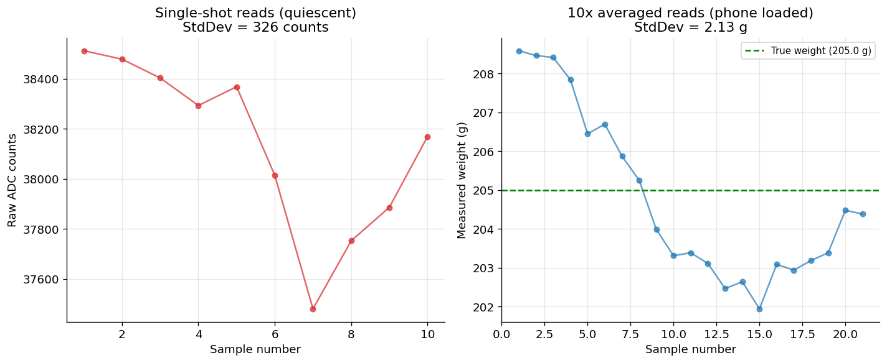
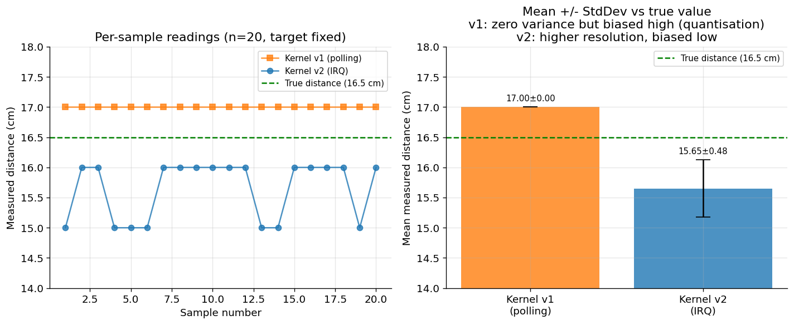
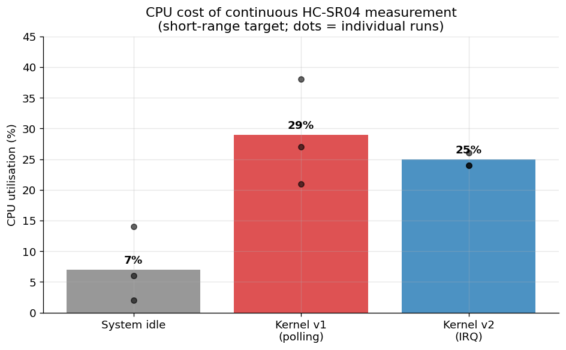
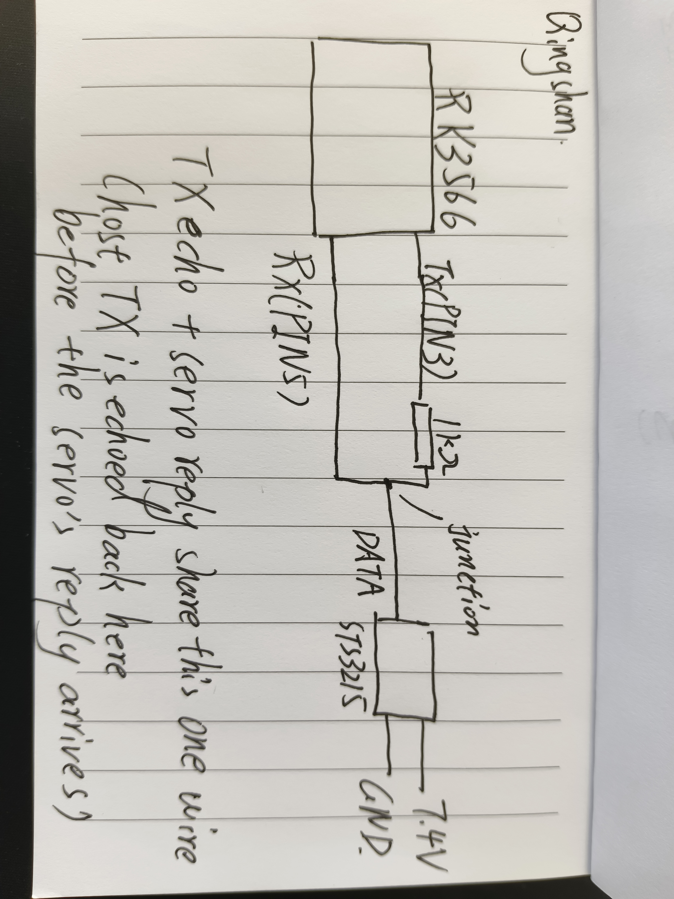

# Smartbench — A Multi-Sensor IoT Edge Device with Custom Linux Kernel Drivers

A graduation project exploring how **custom kernel-space device drivers**
affect resource utilisation, interrupt latency, and measurement quality on a
multi-sensor embedded Linux device, compared with user-space implementations.
The application is a **smart parcel-receiving bench**: a bench-shaped enclosure
that detects, weighs, and acknowledges deliveries automatically. The engineering
focus, however, is the **board support package (BSP) layer** — writing and
characterising the kernel drivers that connect the sensors to Linux.

## Hardware

| Component | Role | Interface |
|-----------|------|-----------|
| Radxa ROCK 3C (RK3566) | Main board, Debian Bullseye, kernel 5.10 | — |
| HC-SR04 | Ultrasonic distance (parcel presence) | 2x GPIO (TRIG/ECHO) |
| HX711 + 20 kg load cell | Weight on the bin top (parcel detection) | Custom 2-wire serial |
| STS3215 | Serial bus servo (paddle actuator) | UART5, half-duplex (serdev) |
| KY-008 laser | Abandoned learning module — see *Engineering decisions* | 1x GPIO |

Sensors are powered at 3.3 V to remain within the SoC's GPIO voltage
tolerance. The STS3215 servo runs on a separate ~8 V rail; all grounds are
common.

The servo was originally on **UART3**; it was migrated to **UART5** after a
hardware fault — see *Debugging story II*.

## Kernel drivers

Each driver is a self-contained loadable module. The sensor drivers use the
misc-device framework; the servo driver is a `serdev` client. Source is under
`drivers/`.

- **hcsr04** — HC-SR04 ultrasonic driver, implemented two ways:
  - **v1 (polling):** busy-waits on the ECHO line; `udelay(10)` trigger pulse
  - **v2 (IRQ):** captures both ECHO edges via GPIO interrupt, timestamps with
    `ktime_get()`, and blocks the reader on a wait queue until the falling edge
- **hx711** — HX711 24-bit ADC driver for the load cell. Bit-bangs the custom
  2-wire protocol with `local_irq_save()` to meet the chip's strict timing
  (SCK high must stay within 0.2–50 µs). Provides 10-sample averaging and an
  `ioctl` interface for tare and scale calibration.
- **sts3215** — Feetech STS3215 serial bus servo driver, built on the kernel
  **`serdev`** subsystem (see its own section below).
- **ky008** — minimal GPIO-output driver, used as an early learning step and
  later abandoned (see *Engineering decisions*).
- **hello** — Hello World module (the starting point).

## Results

### HX711: noise reduction from 10-sample averaging

The HX711 driver reads the 24-bit ADC 10 times per measurement and returns the
average, reducing random noise by approximately √10 ≈ 3.16×. Single-shot
quiescent reads show ~326 ADC counts of standard deviation; after averaging,
weighing a 205 g reference holds within ~2 g. The slow downward drift in both
panels is mechanical creep from a non-rigid mount — averaging cannot remove it,
only rigid mounting can.



### HC-SR04: polling vs interrupt — precision, resolution, and the hardware limit

With the target fixed at a tape-measured 16.5 cm and 20 readings per driver:

- **v1 (polling)** reports 17 cm every single time. Its zero variance is a
  **quantisation artefact** — the polling loop's fixed period bins the pulse
  width coarsely — not true precision, and it carries a systematic +0.5 cm bias.
- **v2 (IRQ)** reports 15–16 cm, resolving sub-centimetre variation via
  nanosecond ISR timestamps.

Neither is dramatically more accurate; absolute accuracy (~±1 cm) is bounded by
the HC-SR04 hardware and the temperature sensitivity of the speed of sound. The
real difference between implementations is in resolution and CPU cost, not
absolute accuracy.



### CPU utilisation: polling vs interrupt

Measured with `top` during a continuous measurement loop, three runs each:

| Scenario | Mean CPU |
|----------|---------:|
| System idle | ~7% |
| v1 (polling) | ~29% |
| v2 (IRQ) | ~25% |

The difference is smaller than the textbook "polling saturates a core"
expectation because the test harness (per-iteration `fork`/`exec` of `cat`)
dominates, and the short-range target produces a brief ECHO pulse. v2 is
consistently lower and far more stable. A follow-up test aimed at open space
(forcing the 60 ms timeout) would expose polling's full cost.



## The servo: serdev, device tree, and half-duplex

The STS3215 is the bench's actuator — a serial bus servo that both drives the
paddle and reports its own state back. Unlike the GPIO sensors, it speaks a
packet protocol (Feetech SCS/STS) at **115200 baud over a single half-duplex
wire** (the rate is held in the servo's own EPROM register), which makes its
driver the most involved of the set.

**serdev, not a raw tty.** Rather than opening `/dev/ttySx` from userspace and
driving termios by hand, the driver is a kernel **`serdev` client** bound to the
UART. serdev models the servo as a device on the serial bus, so probe/remove,
baud configuration, and the RX callback are all handled in driver context. The
trade-off is that there is no `/dev` node to `cat` — a cost that shows up
sharply in *Debugging story II*.

**Device tree without overlays.** The kernel image was built **without
`CONFIG_OF_OVERLAY`**, so the usual overlay route was unavailable. Binding was
done instead by adding a child node (`compatible = "malus,sts3215"`) directly
under the UART node in the **main device tree**, with the original DTB backed
up first.

**Half-duplex request/response on one wire.** Sending a command is one-way, but
reading feedback is a full request/response exchange on a single shared line.
Every byte the host transmits is **echoed back** on that line before the servo's
reply arrives, so the driver:

1. primes a skip counter with the transmit length to **strip the TX echo**,
2. reassembles the reply with a **byte-wise frame state machine**
   (`FF FF . ID . LEN . ERR . params . checksum`), validating the checksum,
3. blocks the reader on a **`completion`** that the RX callback signals once a
   full frame has arrived, with timeout recovery if it never does.

Position, speed, load, voltage, current and temperature are exposed as sysfs
attributes; motion and torque are controlled the same way. Several
`module_param` switches exist purely for field diagnosis: `selftest`, `debug`
(dumps raw RX bytes), `scan` (sweeps servo IDs at load time) and
`baud_override`.



### Debugging story I: the servo that received but never replied

The hardest fault of the first build, kept here because the method matters more
than the fix.

**1 — `serdev_device_write()` returned `-EINVAL`; nothing left the UART.** In
the 5.10 kernel the blocking write path rejects the transfer unless the client
provides a `write_wakeup` callback in `serdev_device_ops`. Wiring in the in-tree
helper `serdev_device_write_wakeup` fixed transmission and the servo moved.

**2 — sending worked, but every feedback read timed out (`-ETIMEDOUT`).** A
diagnostic build that dumped the raw RX bytes showed the problem precisely: the
only bytes received were the host's *own* transmitted packet echoed back —
nothing from the servo. That proved RX hardware worked (it caught the echo) and
that the servo received commands (it moved), narrowing the fault to the
servo→host direction.

**3 — falsifying the wrong hypotheses with a control experiment.** The first
guess (servo response disabled) was tested on a second, independent host — a PC
with an FT232 USB-UART running an equivalent Python script. A naive TX/RX short
gave no reply either, which *looked* confirming but was itself a flawed test: a
push-pull TX with no series resistor fights the servo's reply and suppresses it.
Adding a **1 kΩ series resistor on TX** (matching the board) made the FT232 read
a clean reply — position `0x07FF` = 2047, mid-point. So the servo was fine; both
earlier "failures" were electrical.

**4 — root cause.** With identical wiring the FT232 read replies and the board
did not; the only remaining variable was the board's own wiring — and it was the
most ordinary fault in bring-up: **RX and TX were swapped.** One re-wire brought
up the full loop:

```
PING OK: bytes=[ff ff 01 02 01 fb . ff ff 01 02 00 fc]
feedback: position=2044 speed=0 load=-40 voltage=7.3V current=0mA temp=33C
```

Two of the hypotheses along the way were wrong. The takeaway is the method:
**falsify from the bottom up, and when a hypothesis fails, kill it with a
control experiment rather than arguing for it** — the byte-level diagnostics and
the FT232 comparison are what exposed the real fault.

### Debugging story II: the pin that transmitted but could not receive

Later, after the enclosure was assembled and the harness re-terminated for
tidiness, the servo went silent again — with no code change and the wiring
restored to the same pins. The fault turned out to be a damaged SoC pin, and the
path to that conclusion is the more useful part.

**1 — falsifying the protocol layer.** The two `module_param` switches added for
exactly this purpose did the first cut: `scan` sweeps IDs 0–20 at load time,
`baud_override` forces an arbitrary baud rate. Every ID at every plausible baud
returned nothing, while the driver's own log confirmed the requested and granted
baud matched — so the clock divider was right and the protocol layer was not at
fault.

**2 — a control experiment to split "peripheral" from "host".** The servo was
moved to an FT232 on a PC running an equivalent Python scan. It answered
immediately: **ID 1, 115200 baud**, returning a well-formed PING reply. That
single test cleared the servo, the harness, the supply and the protocol
parameters in one stroke, and left a known-good reference to compare against for
everything that followed. The fault was on the board side.

**3 — separating "parsed wrong" from "never arrived".** Back on the board, the
question was whether bytes reached the driver at all. Guessing here is
expensive, so an unconditional `dev_info()` was placed at the **entry** of
`receive_buf`, before any state-machine logic — if the callback fires at all, it
prints.

It never printed. Not once. That removed the entire frame parser from suspicion
— that code had never executed — and restated the fault precisely: **serdev was
never handed a single byte.**

**4 — verifying the configuration layer, top to bottom.** Three independent
checks, all of which passed:

- `/sys/kernel/debug/pinctrl/.../pinmux-pins` confirmed both pins muxed to
  `function uart3 group uart3m0-xfer`, owned by `fe670000.serial`
- `gpiofind` confirmed the physical header pins mapped to exactly those SoC
  lines — the wires were on the right pins
- the decompiled device tree confirmed `status = "okay"` and a `pinctrl-0`
  phandle resolving to a group containing both TX and RX

Configuration was correct at every layer, and it still did not work.

**5 — the decisive test.** An FT232's TX was wired **directly** to the board's
RX pin — no servo, no half-duplex junction, no series resistor, common ground
only. A 3.3 V push-pull output overwhelms the pin's weak internal pull-up by
orders of magnitude, so the signal unquestionably reached the pin.

`receive_buf` still never fired.

Only one explanation survived: the pin's **input path itself** was dead. TX on
the adjacent pin still worked — a one-sided failure, which is the characteristic
signature of ESD damage, since output stages are typically better protected than
input buffers.

**The most useful lesson came from re-examining the evidence.** The pin had been
"verified" earlier by measuring a voltage on it with a multimeter and by
toggling its pull-up/pull-down through pinctrl. Both of those confirm a **static
DC path** — the pin is connected and its bias circuitry works. UART reception
depends on **dynamic sampling**: deciding a logic level at each bit instant and
assembling bytes. That is a different circuit, and it was the one that had
failed. A static measurement had been used to justify a dynamic conclusion.

**6 — engineering around it.** A dead pin cannot be repaired, so the port was
migrated. `gpiofind`'s full header map gave two adjacent free pins that happened
to carry a UART alternate function — **PIN_32/33 = GPIO3_C2/C3 = UART5_TX/RX
(m1)**. The live DTB was decompiled, the UART5 node enabled with `pinctrl-0`
pointed at the `uart5m1-xfer` phandle, the `sts3215` child node moved across
from UART3, and the recompiled DTB written back over the one the kernel loads
(`/usr/lib/linux-image-$(uname -r)/rockchip/rk3566-rock-3c.dtb`). Two wires
moved, one reboot:

```
sts3215 serial1-0: sts3215 ready (id=1)
sts3215 serial1-0: RX 12 bytes: ff ff 01 02 ...
sts3215 serial1-0: PING OK: total=12 state=0 bytes=[ff ff 01 02 01 fb ff ff 01 02 00 fc]
```

The migration also served as the confirming experiment: changing pins fixed it,
which is exactly what a damaged pin predicts.

One earlier decision paid off here. Because the HAL **discovers the servo's
sysfs directory at runtime** instead of hard-coding it, the device path changed
from `fe670000.serial` to `fe690000.serial` and **not one line of application
code needed editing**.

**Method, in retrospect.** The experiments that mattered were the ones that
halved the search space regardless of outcome — the FT232 control, and the probe
at the callback entry. The one to reach for sooner is the minimal direct
connection: stripping the circuit down to a single known-good driver into a
single pin is what finally separated software from silicon, and it was run far
later than it should have been.

## System integration

A userspace controller (`integration/`) ties the drivers into the actual
parcel-bench behaviour. It is deliberately layered so that the BSP work above
stays cleanly separated from the application logic:

- **`sensors.c` / `sensors.h` — hardware abstraction layer.** One uniform API
  over three *different* kernel interfaces: `read()` on `/dev/hcsr04`, `ioctl()`
  on `/dev/hx711`, and sysfs for the servo. `main.c` contains no `/dev` or
  `/sys` paths at all. The servo's sysfs directory is discovered at runtime
  rather than hard-coded — which is what made the UART migration a zero-line
  change upstream.
- **`main.c` — polling state machine.** The physical model has no door: a single
  paddle sweeps across the bin top, and an ultrasonic sensor mounted on a low
  baffle scans horizontally for a parcel lying in the beam. The loop is
  correspondingly compact — `IDLE -> ACTING -> IDLE`, with sensor faults routed
  to `ERROR`:
  - **Two independent sensors, ANDed.** A trigger requires distance `< 15 cm`
    **and** a weight rise `> 200 g` simultaneously; neither a stray ping nor a
    load-cell glitch can fire it alone.
  - **Debounced.** Both conditions must hold for 3 consecutive samples.
  - **Relative weight against a re-sampled baseline.** The threshold is a
    *delta* from a baseline re-averaged on every return to `IDLE`, which absorbs
    the HX711's slow zero drift instead of fighting it with absolute thresholds.
  - **Open-loop action, deliberately.** Sweep to the action position (+60°, 682
    encoder counts from the 1024 home position), dwell 3 s, return
    unconditionally. Not waiting on servo feedback or load-cell settling
    mid-motion is what keeps the sequence robust against drift and mechanical
    jitter — a case where closing the loop would have made it more fragile, not
    less.
  - **Graceful shutdown.** SIGINT/SIGTERM releases servo torque and closes
    descriptors.

Polling on a fixed period — rather than blocking on each event — is a deliberate
choice here: a deterministic loop period is simple to reason about and fast
enough for this application.

## Deployment: autostart and on-device web control

The device is meant to run unattended from power-on, with no terminal attached.

**Boot-to-operational.** The driver is installed under
`/lib/modules/$(uname -r)/extra` and loaded at boot via `modules-load.d`; a
systemd unit then starts the controller, with a short `ExecStartPre` delay so
the serdev binding has settled before the first sysfs access, and
`Restart=on-failure` to recover from a transient sensor-init failure. Units and
config live in `deploy/`.

**Web control panel.** A separate Flask service (`webctl/`) serves a
phone-friendly page showing live servo position and controller state, plus a
manual sweep button. It is **purely additive** — the proven control binary is
untouched. Manual sweeps borrow servo control by stopping the controller unit,
driving the servo, and restarting it, so the two never write to the servo at
once.

**Self-contained networking.** The venue Wi-Fi authenticates devices by MAC
address, which would have kept visitors' phones off the same network as the
board. Instead the board hosts **its own access point** via NetworkManager,
giving it a fixed address (`10.42.0.1`) that a printed QR code can point at
permanently — no venue network, no internet, and no dependence on DHCP handing
back the same lease.

**A systemd dependency bug worth recording.** The web unit initially declared
`Requires=` on the controller unit. Since a manual sweep *stops* the controller
by design, `Requires` propagated the stop back to the web service — which then
died before it could restart the controller, taking both services down and
making the fault look like a crash. Relaxing it to `Wants=` (keeping `After=`
for ordering) fixed it. A reminder that `Requires` is a **runtime binding**, not
just a startup ordering hint.

## Engineering decisions

**Dropping the KY-008 laser module.** KY-008 began as a GPIO-output learning
step but never produced a usable signal across several wiring and supply
attempts. Rather than let it block the main line it was **deliberately cut** —
presence detection is already covered by the ultrasonic sensor, so the laser
added cost with no payoff. Knowing when to stop is part of the work; contrast it
with the servo above, which was worth chasing to the end.

**3.3 V supply instead of level shifting.** HC-SR04 and HX711 are nominally 5 V
parts whose outputs would need shifting down to the RK3566's 3.3 V GPIOs. After
level-shifting proved fiddly and inaccurate, the sensors were run **directly at
3.3 V**: their outputs then track 3.3 V and match the GPIOs natively, removing
the divider. The cost is slightly reduced range/margin — acceptable at short
range. A simplification bought with a bounded, well-understood trade-off.

**Constraining the demo object instead of adding stall detection.** During
testing a square box dropped into the bin and landed in the paddle's travel
path. The action is open-loop, so the servo could not know it was blocked and
drove against the obstruction at full torque, cracking an acrylic panel. Two
fixes were available: add stall detection in software (compare
`present_position` against the commanded target after a short delay, and release
torque on mismatch), or constrain the demo object so the jam cannot occur. With
the system otherwise finished and stable, the **mechanical fix was chosen** — a
small cylindrical object clears the paddle's arc by geometry, and its curved
face cannot catch the way a box corner does. The software guard remains the
right answer for an unattended deployment; it was the wrong risk to take days
before an exhibition.

**Power sequencing as a standing rule.** After tracing a dead pin to probable
ESD/transient damage, wiring is now only ever changed with everything powered
down, and the rails are sequenced so the board is never live while the servo
supply is switched: **servo on first, board on last; board off first, servo off
last.** The part being protected is the last to arrive and the first to leave, so
it never absorbs the other rail's switching transient.

## Building and running

On the ROCK 3C with kernel headers installed:

```sh
cd drivers/<name>
make
sudo insmod ./<name>.ko
sudo dmesg | tail          # check probe output
```

Unload with `sudo rmmod <name>`. The userspace controller is built and run
separately:

```sh
cd integration
make
sudo ./locker              # needs root for /dev and sysfs access
```

Detection distance, weight-delta threshold, debounce count, dwell time and the
servo's home/action positions are tunable constants at the top of
`integration/main.c` and `integration/sensors.h`.

The web panel runs independently:

```sh
sudo python3 webctl/webctl.py     # serves on :5000
```

## Status

Complete, deployed and exhibited. All drivers working (hcsr04 polling + IRQ,
hx711 with calibration, sts3215 motion + feedback over UART5), the integrated
controller running the full detect -> sweep -> return loop, autostart from
power-on, and the web control panel served from the board's own access point.
Abandoned: ky008. The enclosure and harness are finished.
